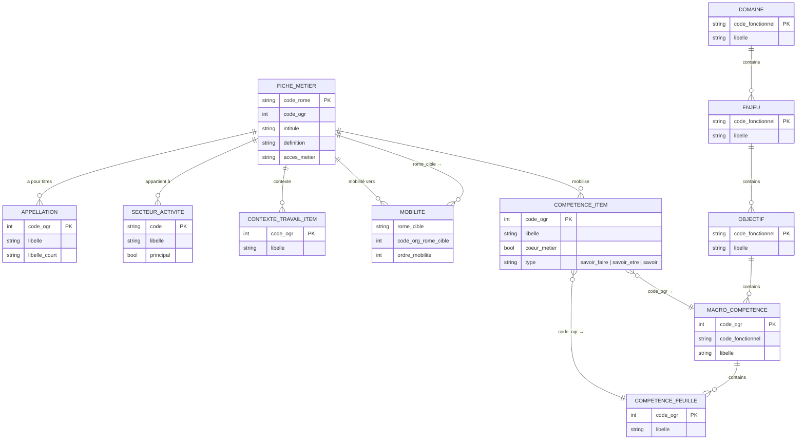

# Structure des données ROME bulk (v4.60)

Analyse des fichiers `data/RefRomeJson/`.

---

## 1. `unix_fiche_emploi_metier_v460.json`

**Array de 1584 fiches métier.** Chaque fiche :

```
Fiche métier
├── numero                          int  (ID interne)
├── rome
│   ├── code_rome                   "A1101"  (identifiant ROME)
│   ├── intitule                    "Conducteur d'engins agricoles"
│   └── code_ogr                    int  (ID numérique alternatif)
├── appellations[]                  titres de poste
│   ├── libelle / libelle_court
│   └── code_ogr
├── definition                      texte
├── acces_metier                    texte
├── competences
│   ├── savoir_faire
│   │   └── enjeux[]
│   │       ├── libelle             "Data et Nouvelles technologies"
│   │       └── items[]
│   │           ├── libelle
│   │           ├── code_ogr        → clé de jointure vers arborescence
│   │           └── coeur_metier    bool|null
│   ├── savoir_etre_professionnel
│   │   └── enjeux[] (même structure)
│   └── savoirs
│       └── categories[]
│           ├── libelle             "Produits, outils et matières"
│           └── items[]  (même structure: libelle, code_ogr, coeur_metier)
├── contextes_travail[]
│   ├── libelle                     "Conditions de travail et risques..."
│   └── items[]  {libelle, code_ogr}
├── secteurs_activite[]
│   ├── code / libelle
│   └── principal                   bool
└── mobilites[]
    ├── rome_cible                  "A1414 - Horticulteur / ..."  (lien vers autre métier)
    ├── code_org_rome_cible         int  (= rome.code_ogr de la cible)
    └── ordre_mobilite              int
```

**Stats moyennes par métier :** ~31 savoir-faire · ~3 savoir-être · ~23 savoirs

---

## 2. `unix_arborescence_competence_v460.json`

**Taxonomie hiérarchique à 4 niveaux** pour classer les compétences.

```
arborescence_competence
└── domaine_competence[]            6 domaines
    ├── libelle_domaine_competence
    ├── code_fonctionnel            "1", "2"...
    └── liste_enjeux[]              32 enjeux total
        ├── libelle_enjeu
        ├── code_fonctionnel        "1A", "1B"...
        └── liste_objectifs[]       84 objectifs total
            ├── libelle_objectif
            ├── code_fonctionnel    "1A1", "1A2"...
            └── liste_macro_competences[]   507 macro-compétences
                ├── code_ogr_macro_competence   → jointure possible
                ├── libelle_macro_competence
                ├── code_fonctionnel            "1A101"...
                └── liste_competences[]         17 810 compétences feuilles
                    ├── code_ogr_competence     → clé de jointure principale
                    └── libelle_competence
```

Les 6 domaines :

| Code | Libellé |
|------|---------|
| 1 | Management, Social, Soin |
| 2 | Communication, Création, Innovation, Nouvelles technologies |
| 3 | Production, Construction, Qualité, Logistique |
| 4 | Pilotage, Gestion, Cadre réglementaire |
| 5 | Développement économique |
| 6 | Coopération, Organisation et Développement de ses compétences |

---

## Liens entre les deux fichiers

```
fiche_emploi_metier                    arborescence_competence
─────────────────────────────          ──────────────────────────────────
competences
  .savoir_faire
    .enjeux[].items[]
      .code_ogr            ──────────► macro_competence.code_ogr_macro_competence
                                  └──► competence.code_ogr_competence

  .mobilites[]
    .rome_cible (string)   ──────────► autre fiche .rome.code_rome
    .code_org_rome_cible   ──────────► autre fiche .rome.code_ogr
```

**Vérification quantitative :** les 16 740 `code_ogr` distincts de savoir-faire dans les fiches sont tous trouvés dans l'arborescence (couverture 100%). Les savoir-être et savoirs utilisent le même espace de `code_ogr`.

---

## Diagramme entité-relation



---

## Points clés pour le projet

- **`code_ogr`** est la clé universelle de jointure pour les compétences entre les deux fichiers
- **`coeur_metier`** (bool) distingue les compétences centrales des secondaires — utile pour pondérer l'ELO
- Les **mobilités** forment un graphe de métiers similaires (données pour des recommandations complémentaires)
- L'arborescence donne le contexte sémantique (domaine → enjeu → objectif) pour regrouper ou filtrer les compétences dans l'UI
- Encodage des fichiers : **ISO-8859 (latin-1)**, pas UTF-8
